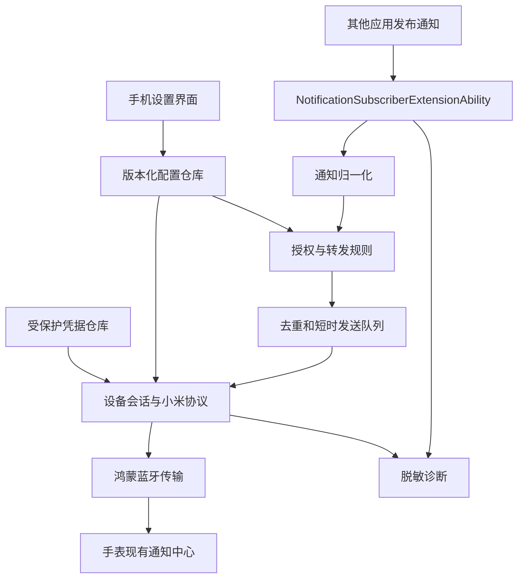

# Redmi Watch 5 鸿蒙通知桥接应用：详细实施方案

版本：v1.2 · 日期：2026-10-06（北京时间）

本文件是开发方案，尚未完成鸿蒙编译、设备签名、通知授权或手表通信实测。接口存在、设备型号被开源项目列为支持，都不等于本项目已经在目标固件上验证通过。

第一轮已创建原生诊断页面、蓝牙配对选择、通知订阅扩展与共享核心测试。实际交付以 [本地构建指南](local-build.zh-CN.md)、[验证记录](round1-validation.zh-CN.md)和 [页面设计](ui-design.zh-CN.md)为准；本文件中协议、认证、完整恢复机制仍是后续计划。

## 1. 目标与结论

为用户现有的华为手机开发鸿蒙原生应用，将用户授权的手机通知，经蓝牙发送到 Redmi Watch 5 原有通知中心，实现文字显示和震动提醒。

首选路线：**手机端原生应用 + 手表现有通知协议**。首版不开发手表应用、不修改手表固件。先验证权限、认证与后台生命周期，再建设完整界面。

| 目标设备 | 已知信息 | 方案依据 |
| --- | --- | --- |
| 手机 | HUAWEI Mate 70 Pro 优享版，PLR-AL50 | 用户提供的设备截图 |
| 手机系统 | HarmonyOS 7.0.0，软件 7.0.0.109，API 26.0.0 | 已满足通知订阅接口 API 22 的版本门槛 |
| 手表 | REDMI Watch 5，M2427W1，非 eSIM | 不与 Watch 5 Active、Lite、Xiaomi Watch 5 混用适配信息 |
| 手表固件 | 3.100.105 | 精确适配对象，协议仍需实测 |

本文件不保存手机 IMEI、设备序列号或实际 MAC 地址。应用连接时通过系统蓝牙接口取得设备标识，不把截图中的地址硬编码进程序。

**成功定义：**手机锁屏、应用不在前台时，指定应用产生的新通知能够在手表显示并提醒；短暂离开后，恢复到正常连接状态可以继续收到新通知。

首版默认按个人自用验证规划。面向公众发布是单独阶段，需要正式权限审批、发布签名和分发准备。

用户已确定协作方式：**云端负责代码与可运行的测试，本地负责 DevEco 编译、签名和真机调试。** 云端增加鸿蒙工具链只作为编译预检的可选增强，不改变本地对设备版本的验收职责。

## 2. 已确认事实与待验证问题

### 2.1 已确认的公开能力

1. 华为受限权限清单允许智能手表配套应用申请 `ohos.permission.SUBSCRIBE_NOTIFICATION`，从 API 22 起提供通知读取与短距离转发能力。[华为权限清单](https://developer.huawei.com/consumer/cn/doc/harmonyos-guides/restricted-permissions)
2. API 26 提供 `openSubscriptionSettingsWithResult`，可在用户完成设置后取得授权结果。通知订阅需要关联蓝牙设备。[华为通知订阅 API](https://developer.huawei.com/consumer/cn/doc/harmonyos-references/js-apis-notificationextensionsubscription)
3. 通知扩展由系统管理生命周期；长时间没有通知时可能被销毁。配对以及支持 HFP 的设备保持 HFP 连接是官方说明中的前提条件。[OpenHarmony 官方概述](https://raw.githubusercontent.com/openharmony/docs/master/zh-cn/application-dev/notification/notification-subscriber-extension-ability.md)
4. Gadgetbridge 将 Redmi Watch 5 列为主要功能支持，要求认证材料；小米 protobuf 协议实现包括应用通知，但具体固件和功能仍有差异。[设备支持表](https://gadgetbridge.org/gadgets/wearables/xiaomi/#redmi-watch-5)、[协议功能说明](https://gadgetbridge.org/basics/topics/xiaomi-protobuf/)

### 2.2 必须通过真机验证的事项

| 编号 | 问题 | 验证结果将决定什么 |
| --- | --- | --- |
| V1 | 当前开发者账号和签名流程能否取得通知 ACL 权限 | 是否能订阅第三方应用通知 |
| V2 | API 26 设备是否正常拉起通知扩展，撤销授权是否立即生效 | 手机端主路线是否成立 |
| V3 | 固件 3.100.105 使用什么数据通道、认证流程和通知消息格式 | BLE 或经典蓝牙的具体选择 |
| V4 | 当前绑定状态下如何取得有效认证材料 | 初始化步骤与是否需要临时 Android 辅助 |
| V5 | 扩展回收后，能否重新建立并认证连接，在有效运行时间内发送消息 | 日常使用是否可靠 |
| V6 | 维持 HFP 时，是否影响耳机、车机、电话音频路由 | 用户可接受的连接配置 |
| V7 | 与现有小米运动健康/兼容容器同时运行是否争抢连接 | 是否需要独占通知数据连接 |
| V8 | 蓝牙关闭、设备重启、进程被终止后，订阅与配对能否恢复 | 自动恢复的实际边界 |

V1～V5 是开发门槛。若只在前台可以工作，应交付为实验原型，不能标记为日常可用版本。

## 3. 当前工作环境与本机工具使用方式

### 3.1 本次已检查的环境

本聊天可访问的是独立云端 `/workspace`。项目目录为 `/workspace/Redmi-watch-5-HMOS-notification`，开始编写方案时没有应用源码。

在当前环境 PATH 中未找到 `deveco`、`deveco-cli`、`devecocli`、`tli`、`hvigor`、`hvigorw`、`ohpm`、`hdc`；有 Node 与 Java。聊天也没有附着的本机终端。这只能说明本次可访问环境中的状态，不能说明用户电脑未安装这些工具。

第一轮随后在临时目录安装官方 `@deveco/deveco-cli@1.3.0-stable`，读取其模板和随包 API 文档；没有安装完整 SDK/Hvigor/OHPM。CLI 的默认日志目录不可在当前沙箱创建，本轮没有执行该 CLI 构建。可运行的 Node 测试已建立，详见验证记录。

用户已说明本机有 DevEco CLI、TLI 等工具。实施时优先使用这些工具；本方案不要求重新安装。TLI 的具体来源、版本和功能尚未核验，先读取其帮助，不预设其能完成签名或设备测试。

### 3.2 开发开始时的只读盘点

在能够访问本机终端后，保存非敏感的工具清单：

| 检查内容 | 用途 |
| --- | --- |
| DevEco CLI 的路径、版本、帮助与工程模板列表 | 确定真实命令语法、创建 Stage 工程 |
| TLI 的路径、版本和帮助 | 明确它可承担的检查或测试任务 |
| HarmonyOS SDK 26.0.0 及其公开 API 定义 | 核对目标 SDK、接口名称与类型 |
| Hvigor、OHPM、Node、Java 版本 | 固定可复现的构建组合 |
| HDC 路径与已授权设备列表 | 确认手机可安装、运行和获取日志 |
| 本机操作系统和 CPU 架构 | 选择对应的命令与构建脚本 |
| 调试 Profile 的包名、有效期、设备覆盖和 ACL 清单 | 确认实际签名权限，不读取私钥或密码 |

命令示例只作为盘点模板，以已安装版本的帮助为准：

```text
devecocli --help
tli --help
ohpm --version
hdc list targets
```

若工具不在 PATH，使用现有安装目录中的可执行文件。签名文件不进入仓库，命令输出不得包含认证密钥、登录令牌、私钥或密码。

### 3.3 构建和真机执行的分工

云端可承担文档、源码编辑、协议测试与非设备检查。本机承担 HarmonyOS SDK 编译、签名、手机安装和蓝牙实测。除非本机终端和设备确实可访问，否则不把云端模拟测试写成真机测试成功。

第一轮已根据官方 CLI 模板格式在云端创建 Stage 工程，并配置目标 API 26。实际兼容性由本机 DevEco 首次同步和编译确认，必要时回传平台适配差异。官方 npm 包当前注册的可执行名称是 `devecocli`；若本机另有包装命令，盘点时记录实际名称。

### 3.4 云端与本地的交付闭环

| 工作 | 云端负责 | 本地负责 |
| --- | --- | --- |
| 需求、协议研究、设计 | 编写与维护方案、研究记录、协议实现 | 回传设备实际表现与可用认证路径 |
| 项目基线 | 创建并维护无签名源码工程，固定依赖与测试工具 | 使用现有 DevEco 同步/编译工程，输出非敏感版本清单 |
| 主要源码 | 通知归一化、规则、会话、协议、传输适配与 UI | 核对 SDK 接口和平台行为，提供编译诊断 |
| 可运行测试 | 执行核心逻辑、帧、认证向量、模拟传输和回归测试 | 执行鸿蒙运行时测试，确认系统密码与设备结果 |
| 编译 | 可选无签名编译预检 | 权威 DevEco 构建、依赖解析与安装包产生 |
| 签名 | 维护占位配置与权限说明 | AGC、ACL、Profile、设备注册和实际签名 |
| 硬件验证 | 根据脱敏记录定位并修复 | 蓝牙、通知、锁屏、HFP、重启和耗电实测 |

每一轮按相同代码版本进行：

1. 云端交付一个小范围代码变更，附实际执行的测试命令、结果、待验证事项和依赖变化。
2. 本地获取该版本，使用固定 DevEco 配置编译、签名、安装；先完成最小的对应设备用例。
3. 本地反馈带版本号的构建结果或脱敏设备记录。
4. 云端修复，并对失败场景增加有意义的回归用例；下一轮重测受影响内容。

通过 Git commit 标识绑定源码与测试报告；第一轮使用 `codex/round1-notification-probe` 分支和草稿 PR 交付，后续修复更新同一分支。本地不必先合并即可验证。若临时无法远端同步，则用带 SHA-256 的源码归档交付，不能凭“最新版”描述一个不可追踪版本。

签名配置、私钥、Profile、账号凭据和实际 AuthKey 保留在本地或受保护的设备存储；模板回传时排除它们。本地修改系统适配代码后也要同步回共享源码，避免形成两套实现。

### 3.5 本地反馈格式

本地每轮反馈包括：代码版本、SDK/CLI/Hvigor 版本、构建命令、结果、手机和手表版本、权限状态、连接条件、重现步骤与预期/实际表现。编译失败优先给出第一个有意义的错误及上下文，不需要导出整个开发者目录。

设备记录至少区分：未收到平台回调、规则过滤、连接失败、认证失败、写入失败、确认丢失、手表未显示、手表未震动。对日志进行脱敏后才能作为云端重放输入；真实密钥和正文不能成为仓库 fixture。

配套报告模板见 `docs/local-validation-template.zh-CN.md`。

## 4. 产品范围

### 4.1 v0.1 验证原型

只需要设备与通知诊断页面，包含：

- 取得蓝牙权限、选择现有手表、展示分层连接状态。
- 导入用户自己的设备认证材料并安全保存。
- 打开系统通知授权页面，显示授权结果。
- 手动发送包含序号的测试通知。
- 显示通知回调、处理、发送、确认或失败的统计。
- 导出默认不含正文的诊断记录。

### 4.2 v0.2 最小可用应用

| 功能 | 首版行为 |
| --- | --- |
| 应用通知同步 | 支持系统已授权应用，先实测微信、短信、一个普通应用 |
| 消息显示 | 应用来源、标题、正文摘要；空字段使用明确的降级内容 |
| 震动与亮屏 | 使用手表原有行为，遵循手表勿扰与可用设置 |
| 应用选择 | 系统授权列表与应用内部转发开关共同决定 |
| 去重与更新 | 同一通知重复回调不反复提醒；真实内容更新按规则处理 |
| 隐私选项 | 可仅显示来源，或显示标题/正文；不默认保存历史正文 |
| 连接恢复 | 在系统允许的生命周期内重新连接、认证；显示恢复失败原因 |
| 断线策略 | 默认不补发旧消息；短暂连接失败只保留少量、短时待发送项 |
| 通知取消 | 优先验证手机取消同步到手表；协议不支持时明确降级 |

### 4.3 后续扩展

来电号码与状态、接听拒接、手表反向取消手机通知、快捷回复、图片、健康数据、天气、表盘和固件更新，均作为独立功能评估。文字通知验证通过不意味着这些能力自动成立。

首版不以“全面替代小米运动健康”为目标。不修改手表固件，不以刷机、root 或修改系统签名作为正常安装步骤。

## 5. 技术选型

| 层级 | 建议选择 | 选择理由 |
| --- | --- | --- |
| 手机应用 | ArkTS + ArkUI，Stage 模型 | 直接使用鸿蒙公开能力与系统扩展 |
| 原型 SDK | HarmonyOS API 26.0.0，优先与手机一致 | 利用返回授权结果的新接口，缩小验证变量 |
| 原型最低兼容版本 | API 26.0.0 | 先服务当前设备；适配 API 22～24 放到后续 |
| 通知接入 | Notification Kit 的通知订阅扩展 | 面向三方穿戴的官方入口 |
| 蓝牙 | Connectivity Kit；BLE 和 RFCOMM/SPP 通过适配层隔离 | 根据固件实测选用，首版只完成实际需要的通道 |
| 协议 | 参考 Gadgetbridge 的当前小米实现和 schema | 复用已研究的认证与消息格式 |
| 编解码 | 小范围 protobuf 消息实现或可验证的生成代码 | 先支持握手、基础信息和通知，避免完整健康协议移植 |
| 密码运算 | 鸿蒙系统密码能力；必要时再评估 Native 模块 | 算法、模式和字节格式以协议源码及测试向量为准 |
| 凭据保护 | HUKS/系统密钥保护 + 应用私有密文存储 | 原始认证材料不写普通 Preferences 或日志 |
| 普通配置 | Preferences；需要跨组件一致性时封装版本化配置仓库 | 保存设备选择、规则、授权状态快照 |
| 诊断 | hilog + 有界事件记录 | 支持定位失败，避免无限日志和消息正文暴露 |
| 测试 | 本机鸿蒙测试工具 + 协议固定输入输出测试 + 真机验证 | 区分编译、编码正确性和实际设备行为 |

这里的 API 26 是原型的建议配置，创建工程后需按实际 SDK 版本字符串填写。SDK 模板、构建插件和签名工具必须使用兼容组合，不把数字直接当成所有配置文件的合法值。

不预先选择全部密码算法，也不假设任意 JS protobuf 包都能直接在 ArkTS 使用。第一轮技术验证应核对 ArkTS 限制、ArrayBuffer 字节边界、依赖体积和测试可用性。

## 6. 架构与模块边界



完整功能建议源码组织如下。第一轮实际已创建 `entryability`、`extensionability`、`pages`、`core`、`platform`、`config`；其余目录按协议验证进度添加：

```text
entry/src/main/ets/
  entryability/                 应用 UI 入口
  extensionability/             通知订阅扩展
  pages/                        首页、设备、规则、诊断
  domain/                       内部事件与状态模型
  notification/                 授权、归一化、规则、去重、发送队列
  device/                       设备配置、会话状态机
  transport/                    BLE、SPP 通道接口及实际适配
  protocol/xiaomi/              认证、分帧、消息、protobuf 子集
  storage/                      配置、凭据、少量状态元数据
  diagnostics/                  脱敏事件与指标
entry/src/ohosTest/              真机或鸿蒙运行时测试
tests/protocol/                 固定测试向量与帧测试
docs/                           权限、设备验证、协议发现、测试报告
scripts/                        工具版本确认后固定的构建与检查脚本
```

### 6.1 组件生命周期与连接所有权

实际通知转发由通知扩展负责；界面负责配置和诊断。扩展必须能独立加载配置、读取受保护凭据、创建或恢复会话，不依赖用户之前打开过某个页面。

UI 与扩展不假定同进程，不依赖共享全局变量。首版采用“同一时间一个组件拥有通知数据连接”的简单规则：

- 正常转发模式：通知扩展拥有数据会话；UI 读取持久化的状态快照，不能随意另开连接。
- 手动通信调试模式：明确暂停正常转发，再由 UI 控制测试会话；退出时关闭测试通道并恢复通知订阅流程。
- 若平台实测需要跨进程协调，以当前 SDK 支持的方式实现，验证重复拉起、竞争和崩溃恢复；不虚构任意可常驻后台服务。

单进程内并发通知共用一次连接与认证过程，通过串行写入队列避免多个消息争抢握手。持久化配置带 schemaVersion，更新采用一致性写入，扩展在处理消息前加载有效版本。

### 6.2 设备会话状态

内部状态至少包括：未配置、等待系统配对、等待凭据、断开、连接中、认证中、可发送、恢复中、需要用户处理。

只有协议认证和必要初始化成功才显示“可发送”。连接状态页分别显示系统配对、HFP、数据通道、协议认证和通知授权；不把一个蓝牙图标当成全部功能可用。

断线后废弃旧会话计数、nonce 和运行时密码状态；按具体协议重新握手。错误密钥不无限重试，转为需要检查绑定状态的错误。

## 7. 权限与签名实施

| 权限/配置 | 计划用途 | 验证点 |
| --- | --- | --- |
| `ohos.permission.SUBSCRIBE_NOTIFICATION` | 获取授权通知 | ACL 是否写入对应模块与 Profile，设备是否认可 |
| `ohos.permission.ACCESS_BLUETOOTH` | 使用系统蓝牙接口 | 用户授权、配对、连接与设备标识获取 |
| `notificationSubscriber` 扩展声明 | 接收系统通知回调 | 扩展类型、入口路径、导出配置与资源合法 |
| 本应用发送通知的许可 | 测试来源或将来需要的本应用提示 | 与读取其他应用通知的授权分开处理 |
| 其他权限 | 仅在具体 API 要求时增加 | 原型不预设互联网、通讯录、短信读取等权限 |

API 26 的 ACL 配置和审批流程比早期教程更具体，实施时应按当前 DevEco/AGC 流程提交场景与附件，并检查 Profile 的权限和有效期。官方说明存在审批前临时 Profile；其适用性与实际有效期必须核验，不能承诺一次调试签名就永久解决授权。[华为自动签名说明](https://developer.huawei.com/consumer/cn/doc/HarmonyOS-Guides/ide-signing-auto)

拟准备的权限申请材料：

- 产品用途：将用户授权的本机通知通过蓝牙转发到其 Redmi Watch 5。
- 设备型号与通知功能说明，连接与授权流程图。
- 应用内的读取开关、应用选择、停止转发与删除设备入口。
- 数据流说明：消息转发本地完成，正文不上传服务器，诊断默认不包含正文。
- 模块、使用场景、调用时机和演示材料；若需要设备厂商合作资料，单独向平台确认要求，不假设个人账号一定获批。

申请实际提交和账号操作留到实施阶段；本次只制作方案。

## 8. 手机通知接入

流程：检查签名与蓝牙授权 → 选择已配对设备并取得系统标识 → 注册通知扩展订阅 → 引导系统通知授权 → 读取授权结果 → 用另一个应用发通知验证回调。

API 26 优先使用 `openSubscriptionSettingsWithResult`。应用内部的转发开关不能代替系统授权。应用列表优先来自系统提供的已授权应用信息，不为了枚举全部安装包扩大权限。

开发时核对实际 SDK 的 `subscribe`、`getSubscribeInfo`、`isUserGranted`、授权列表与取消订阅接口。接口名称和类型以安装 SDK 为最终编译依据。

接收事件转为内部模型，至少保留：来源包名、分身索引、系统通知标识、标题、正文、收到时间、可用的发布时间和分组信息。取消事件映射到同一通知身份。字段映射依据 [官方 NotificationInfo](https://raw.githubusercontent.com/openharmony/docs/master/zh-cn/application-dev/reference/apis-notification-kit/js-apis-inner-notification-notificationInfo.md)。

归一化原则：

- 源通知仅写“你收到一条新消息”时，只能转发这段内容，不能恢复聊天数据库里的真实正文。
- 先验证微信、短信真实字段，不写死推测的包名或私有通知结构。
- 不以标题为空为理由丢弃所有通知；按来源与允许的内容字段降级。
- 过滤本应用生成的诊断通知，避免转发循环。
- 测试来源应用采用独立包，避免本应用通知特殊行为掩盖第三方接入问题。

## 9. 手表协议与初始化

### 9.1 初始化策略

首版优先支持安全导入已有 AuthKey，先不在应用内实现完整小米账号登录。认证密钥只能来自用户自己的设备和账号，不写进文档、测试文件或命令历史。

若没有可用材料，按当前官方绑定状态研究已有工具。可以临时使用 Android 手机的官方应用完成绑定与基线测试，或评估桌面工具取得材料；是否需要借 Android 手机不能提前断言。[Gadgetbridge 配对说明](https://gadgetbridge.org/basics/pairing/huami-xiaomi-server/)

任何换绑、取消配对、恢复出厂或固件变更，先说明具体影响再决定操作。已有配对状态和健康数据优先保留，方案验证不以重置作为第一步。

### 9.2 协议研究顺序

1. 固定 Gadgetbridge 参考版本/commit，记录许可证、设备型号和实现路径。
2. 读对应设备的 coordinator、support、transport、认证服务、通知服务和 protobuf 定义。
3. 查明 BLE 服务/特征或 SPP UUID、传输 framing、认证与加密、消息序号、ACK 和初始化要求。
4. 使用虚构密钥与固定输入建立测试向量；确认系统密码接口结果与参考实现一致。
5. 真机先认证并读取一个安全的基础字段，如设备信息或电量。
6. 发送带序号的中文测试通知，观察震动、亮屏和通知中心记录。
7. 验证断开后重连、重新认证和重复发送行为。

不能直接复制官方通知扩展示例里的示例 SPP UUID 或 JSON 内容给小米手表。官方示例说明平台传输方式，小米手表仍要求自己的认证与消息格式。

本次未能通过浏览工具读取 Codeberg 上的具体协议类源码，因此算法、UUID、字段号与 ACK 语义均保留为研究任务，不填写猜测值。

### 9.3 BLE 与经典蓝牙的选择

先根据现有配对、服务发现和参考源码确定通道。检测结果与协议握手共同决定选择，不凭蓝牙版本号判断。

若 BLE 可以完成目标，先实现 BLE。若该固件依赖 SPP，就直接完成 SPP，不强行转成 BLE。对接口做抽象是为隔离协议逻辑，不意味着首版同时实现两套完整通道。

HFP 是单独连接条件，既不替代数据通道，也不自动代表通知已可发送。验证维持 HFP 对耳机与电话的影响；若需要关闭该连接才能满足日常音频体验，必须确认这是否会使通知订阅失效。

## 10. 后台运行与恢复

扩展每次被系统拉起时都应能重新执行：加载配置 → 检查允许状态 → 准备凭据 → 获取/建立通道 → 认证 → 发送当前通知 → 清理或更新状态。

先测量系统给予扩展的实际运行时间与异步操作行为，记录冷启动、通道建立和认证分别耗时。若冷启动无法在允许时间内完成，评估真实适用的后台蓝牙能力与长时任务条件；不预设申请长时任务即可永久保活。

空闲回收允许发生。需要保证回收后新的通知能重新触发并完成转发，而不是靠高频扫描、空通知或定时器维持进程。

重试的建议初值：单个通知最多两次发送尝试；连接恢复采用 1、2、4、8 秒退避和小幅随机偏移，只在组件仍运行且系统允许时执行。扩展被销毁即取消任务，不能承诺后台定时器持续运行。具体预算在原型测试后调整。

重新启动手机后，先实测系统订阅和配对保留情况。若系统无法自动恢复，提示用户打开应用完成恢复，不以未验证的开机广播或自启动权限保证自动启动。系统“强行停止”也需要独立记录，不能与正常后台回收混为一谈。

用户主动断开、暂停或撤销授权时，不自动重新开启同步。

## 11. 转发规则、去重与队列

### 11.1 推荐默认值

| 规则 | 初始值 | 说明 |
| --- | --- | --- |
| 应用选择 | 用户主动选择 | 不默认转发所有应用 |
| 正文展示 | 首次设置时明确选择 | 可以只显示来源，也可以展示标题和正文 |
| 重复回调 | 同身份、同内容不再发送 | 与连续收到多条真实消息区分 |
| 发送队列 | 最多 20 项，最长等待 60 秒 | 原型初值，防止断线后集中震动 |
| 旧消息补发 | 默认关闭 | 不依赖系统能补回断线时未交付的通知 |
| 长文本 | 按实测字节上限截断 | 保留 UTF-8 字符边界，不能切断中文或 emoji |
| 分组摘要 | 先记录后选择规则 | 避免把真实内容误删 |
| 勿扰 | 尊重手表与用户设置 | 不为提醒效果擅自关闭手表勿扰 |

通知身份以系统标识为核心，并考虑来源与分身索引。同一身份内容改变时可更新；不同身份即使文字相同，也可能是两条真实消息，不能仅凭正文 hash 合并。

更新是否再次震动、摘要是否与子通知重复，需要微信等实际样本验证。首版不靠大量关键词猜测“哪些通知不重要”。

### 11.2 确认与失败语义

记录四个阶段：平台收到、规则允许、传输已写入、协议已确认。协议 ACK 不能等同于用户看到了手表提示，验收必须观察设备。

连接在发送后中断但 ACK 丢失，会出现“可能已收到”的不确定状态。只有验证了手表端稳定 ID 的更新/去重行为，才在这种情况下自动重发；否则记录不确定并等待下一条，避免制造重复提醒。

默认内存短队列随扩展生命周期结束清理。若后续确有持久化补发需求，再增加加密短时队列和取消标记；不能为了恢复方便默认保存全部聊天正文。

取消、过期、关闭同步或撤销应用授权，都应移除对应待发送项。

## 12. 界面与用户流程

建议四个页面：

1. **首页：**手表名称、能否转发、最近成功时间、暂停/恢复、发送测试消息。
2. **设备与授权：**选择设备、导入认证材料、检查连接、打开系统授权、移除设备。
3. **通知规则：**应用开关、内容展示、勿扰规则、是否补发。
4. **诊断：**成功/失败数量、延迟、最近错误、导出脱敏报告。

首次使用：选择手表 → 完成系统配对 → 导入认证材料 → 手动通知验证 → 授予读取通知 → 选择来源应用 → 第三方通知验证 → 锁屏验证。

普通页面使用“需要重新连接”“通知访问未开启”“设备认证失败”等可行动文案。UUID、protobuf、nonce、ACL 错误码只出现在开发诊断中。

状态页显示最近状态采集时间；UI 不在运行时不能假装连接状态是实时的。认证材料导入后以“已保存”显示，不持续显示密钥文本。

## 13. 分阶段任务与交付物

| 阶段 | 任务与交付物 | 通过条件 | 未通过时的处理 |
| --- | --- | --- | --- |
| M0：工具与工程 | 本机工具报告、Stage 空工程、固定构建/安装命令 | 空 HAP 成功签名安装，应用启动，能获取日志 | 修复 SDK/模板/签名，不进入蓝牙实现 |
| M1：平台通知 | ACL 资料、通知扩展、独立测试来源应用、订阅诊断 | 已配对设备关联后，第三方通知回调在锁屏和后台可用，撤销授权有效 | 处理权限、扩展配置与平台条件；不借手表应用绕过 |
| M2：手表会话 | 认证研究记录、传输实现、协议测试向量、手动下发按钮 | 目标固件认证成功，20 条带序号测试通知均显示，重连后继续成功 | 检查密钥、通道、初始化、参考版本；必要时采集受控通信样本 |
| M3：后台闭环 | 扩展内转发、冷启动会话、规则与错误记录 | UI 不在前台，长时间空闲后仍能把新通知下发 | 定位生命周期/恢复时长；未解决则只标记实验版 |
| M4：可用版本 | 四页 UI、应用选择、去重、隐私、暂停与诊断 | 下方验收矩阵通过，失败有明确状态 | 修复具体问题，不用“保持界面打开”当完成 |
| M5：个人试用 | 可安装包、安装说明、48 小时记录与已知限制 | 用户日常场景稳定，无持续耗电或明显音频影响 | 回到相应模块修复，重新测试受影响场景 |
| M6：可选发布 | 正式 ACL、发布签名、隐私说明、许可清单、市场材料 | 审核和正式分发链路通过 | 不以调试包或临时 Profile 冒充正式版本 |

M1 与 M2 可独立研究，但 M1 仍需真实设备的系统配对/关联条件，两者不是完全无依赖。实际执行可先准备 M1，同时整理 M2 的参考源码和认证材料。

每阶段报告记录：工具版本、代码版本、目标固件、配对状态、权限状态、步骤、结果和限制。对外截图遮盖设备标识与通知正文。

## 14. 验收与测试矩阵

以下数字是计划目标，尚未取得测量结果。样本范围为本手机、本固件及已授权应用；“收到率”只统计系统确实交付给本应用的通知，另行核对来源应用通知与平台回调之间的缺口。

| 场景 | 方法 | 初版验收目标 |
| --- | --- | --- |
| 连通基线 | 20 条人工测试通知，唯一序号 | 全部在手表显示，无内容错乱 |
| 稳定通道 | 100 条平台已交付的普通通知 | 100 条均可追踪，至少 99 条显示；任何未显示都要定位后复测 |
| 连通延迟 | 记录平台回调至手表观察时间 | 稳定连接 P95 ≤ 3 秒；冷恢复单独统计，暂定 ≤ 10 秒 |
| 锁屏后台 | 三类应用各至少 10 条通知 | 退到后台、锁屏后正常转发，不要求界面常开 |
| 空闲后唤醒 | 静置 30 分钟、2 小时、整夜后发新通知 | 新通知仍能重新连接并显示，记录冷恢复时间 |
| 通知取消/更新 | 发布、重复、更新、删除，至少 20 组 | 去重不误删，支持的取消行为一致；不支持项列为限制 |
| 短暂离开 | 手表离开范围后返回，重复 10 轮 | 系统连接条件恢复后，新通知可继续转发；不集中补发过期项 |
| 蓝牙开关 | 关闭再打开，重复 5 轮 | 恢复或清楚提示需要的操作，无无限重连循环 |
| 设备重启 | 手机与手表分别重启各 3 轮 | 记录自动恢复与需打开应用的边界 |
| 停止与撤权 | 暂停、关来源开关、撤销总授权 | 后续通知不转发，队列被清理 |
| 中文与 emoji | 长文本、中英混合、组合 emoji | UTF-8 截断合法，手表不支持的字形明确降级 |
| 群聊与分身 | 连续多条、分组摘要、可用的应用分身 | 不因相同文字误去重，标识不混淆 |
| 突发通知 | 10 秒内 30 条 | 队列有界，无崩溃；丢弃数量与规则可追踪 |
| HFP 与音频 | 耳机、电话；有车机时另测 | 不异常切换音频；若有影响则说明所需设置与代价 |
| 共存 | 现有小米应用开/关两种情况 | 确认连接竞争和可能出现的重复提醒 |
| 低电量与节电 | 低电量/节电状态分别测试 | 记录可靠性变化，不自动绕过系统设置 |
| 48 小时使用 | 实际使用并比较无桥接基线 | 无持续扫描；手机耗电增量先以每日 ≤ 3 个百分点为目标，手表也记录基线差异 |

人工观察时同步时钟并记录误差，不能用人工结果宣称毫秒级延迟。传输 ACK、屏幕展示和震动分开计数；勿扰、未佩戴或来源隐私设置造成的行为单独注明。

自动测试优先覆盖有实际风险的内容：认证测试向量、分帧边界、拆包粘包、断线计数重置、UTF-8 截断、通知身份与更新、ACK 不确定性和撤权清队列。UI 文案及简单布局通过检查与真机走查即可。

## 15. 风险与决策分支

| 风险 | 优先行动 | 决策边界 |
| --- | --- | --- |
| ACL 获取或正式审批失败 | 核对当前签名流程、提交场景材料、向平台确认资格 | 不能承诺普通安装包读取所有通知；暂停自动通知产品化 |
| 固件协议变化 | 固定参考版本、比较安全样本、完成最小消息适配 | 不未经评估自动降级/升级固件 |
| 认证材料获取困难 | 研究当前绑定与自有账号工具，必要时 Android 临时辅助 | 不默认把小米账号密码加入应用 |
| 扩展生命周期太短 | 测量冷启动与握手，核对适用后台能力 | 只能前台工作则保留实验版标签 |
| HFP 冲突 | 测试耳机与通话路由、确认订阅条件 | 用户音频需求不能满足时，需明确无法同时保证 |
| 多个配套应用争用 | 独占会话策略、设置共存测试 | 不承诺同步通知和全部官方健康功能同时可用 |
| 发送状态不确定 | 验证协议 ID/ACK，采用保守重试 | 不宣称绝对不漏、不重，报告可测范围 |
| 依赖与许可证 | 固定来源、保留版权和许可、评估移植范围 | 直接移植 AGPL 源码的分发方案按许可证准备 |

“手机 + 手表快应用”作为后备研究路线，仅在确认直接协议无法达到目标，而且快应用具备实际通信、后台和提醒能力时再评估。它仍需要手机通知授权，不能解决 ACL 门槛。

官方 Vela interconnect 文档有 Android 配套应用签名条件；直接 BLE 支持表也不支持 Redmi Watch 5。因此当前没有足够证据把快应用作为更简单的首选。[小米 interconnect](https://iot.mi.com/vela/quickapp/zh/features/network/interconnect.html)、[小米快应用 BLE 支持](https://iot.mi.com/vela/quickapp/zh/features/system/bluetooth.html)

## 16. 预估投入与下一步

按单人开发、工具已安装、能够反复测试设备、参考协议能复用的条件估算：

| 工作 | 预计投入 |
| --- | --- |
| 工具核验、工程、签名与通知原型 | 1～3 个工作日 |
| 认证研究、实际通道与手动通知 | 3～7 个工作日 |
| 后台闭环、规则与应用界面 | 4～6 个工作日 |
| 稳定性修复、真机验收与个人试用 | 3～5 个工作日，另含 48 小时观察 |

个人可用版本约 **11～21 个工作日的开发投入**。这是条件估算，不是交付承诺；ACL 审批等待、账号资格问题和大幅协议变化单独计时。原型阶段结束后根据实测重新估算。正式上架不包括在上述估算中。

开始实施时先完成 M0，并交付一个可安装的 v0.1 骨架，优先包含“权限检查、设备关联、手动测试、脱敏诊断”。随后分别打通通知接入与手表下发。只有后台闭环通过，才投入完整产品界面与长期试用。

本次交付为方案；下一轮先由本地提供已编译的空工程和工具版本清单，云端建立核心测试结构。两项完成后进入通知与手表通信原型。

## 17. 云端可运行测试的具体设计

### 17.1 测试实际应用核心，而非另一份示例实现

业务核心与平台适配层分开。核心包括规则、身份映射、队列、会话状态机、分帧和消息编解码；适配层包括 `@kit` 通知、蓝牙、系统密码、HUKS、Preferences 和 UI。

建议将核心写为不依赖 `@kit`、不使用装饰器的受约束 `.ets` 源码，并尽量使用普通类、显式类型、数组和字节缓冲。云端测试构建只将扩展名机械映射成 `.ts`、处理必要的模块路径，使用锁定版本 TypeScript 编译后在 Node 运行。此方式是候选方案，须在最小工程上同时验证 Node 测试与本地 ArkTS 编译后才固定。

要求：

- 只有一份核心实现，不维护“测试专用认证算法”或另一套规则引擎。
- 测试构建保留文件映射和内容 hash；除文件名/模块路径外不重写业务行为。
- 平台功能通过接口注入，使用 fake clock、虚构随机数、mock transport 和测试凭据。
- Node 测试通过证明逻辑在该测试运行时成立；不能证明 ArkTS 编译、系统扩展生命周期或 HUKS 行为成立。
- 若 SDK 不允许该源布局，由本地验证最小兼容方案后调整；不靠删除类型限制让云测试“看起来通过”。

目录补充：

```text
tests/
  unit/                         核心规则、身份、队列、状态机
  protocol/                     固定消息与认证向量
  integration/                  模拟手表与断线重连
  fixtures/                     虚构凭据、预期帧、脱敏事件
scripts/
  cloud-core-build.*            机械转换与测试编译
  cloud-check.*                 类型检查、测试、报告输出
  local-build.*                 工具确认后编写的本地构建入口
reports/
  cloud/                        生成的测试统计，默认不提交大文件
  local/                        脱敏报告和设备结果
```

### 17.2 每轮云端执行的测试

| 测试层 | 具体内容 | 如何避免自证正确 |
| --- | --- | --- |
| 规则与队列 | 授权开关、取消、更新、分身、限长、过期和突发 | 根据产品行为给定输入和期望输出，不照抄内部实现步骤 |
| 字节与帧 | 已知帧、分包、粘包、异常长度、序号边界 | 固定独立预期字节和畸形输入，不仅测试 encode→decode |
| 认证 | 有来源的虚构密钥/固定挑战测试向量 | 与独立参考实现结果比较；实际算法待协议研究后确定 |
| 会话 | 并发到达、连接失败、认证失败、回收、重新握手 | 注入时钟和故障，确认有限重试、无重复会话与状态恢复 |
| 传输集成 | 模拟手表响应、丢 ACK、断线、慢响应 | 模拟器按已确认协议响应，明确它不验证实体设备兼容性 |
| 事件重放 | 复现已脱敏且许可使用的通知/通信故障 | 固定来源记录与预期状态，密钥与正文使用虚构替代值 |

真实密码适配的对照测试在本地鸿蒙运行时执行；云端可用 Node 密码库提供参考输出，但不能把 Node 库替代系统密码接口后的通过结果写成设备认证成功。

### 17.3 云端测试命令与报告约定

计划统一为 `npm run check`、`npm test` 和 `npm run test:integration`。这些是未来工程要提供的入口，当前文档仓库没有这些脚本，不声称已经可运行。

每次交付必须列明实际执行结果：通过数、失败数、跳过数、运行环境与代码版本。测试失败退出非零，不能用跳过或 mock 全部平台功能掩盖缺口。协议与核心变更没有通过云端测试，不进入本地设备验证；首次基础工具链验证除外。

本地另列 `DevEco build`、签名安装、鸿蒙运行时测试、手表通知实测和后台验收结果。一个阶段完成要同时满足对应的云端与本地检查。

## 18. 云端部署鸿蒙开发环境的性价比评估

### 18.1 实际查验结果

| 项目 | 本次观察 | 含义 |
| --- | --- | --- |
| 云端系统 | Linux x86_64 | 官方 CLI/命令行构建有对应平台支持 |
| Node / npm | Node 24.19.0，npm 11.9.0 | 满足当前 DevEco CLI 的 Node ≥22 包要求；Hvigor 仍用其配套版本 |
| Java | OpenJDK 21.0.12.1 | 已有运行时，是否兼容工具链需按配套关系核验 |
| 可见磁盘/内存 | `/workspace` 可用约 30 GB，可见内存约 9.7 GiB | 小规模 CLI/SDK 评估有空间；此统计不保证容器资源配额或模拟器可用 |
| npm 元数据 | 官方 `@deveco/deveco-cli@stable` 为 1.3.0-stable，可执行名 `devecocli` | 已只读查询成功；主包解压约 56.6 MB，不含依赖与 SDK |
| 网络 | npm/GitHub 等允许；当前没有华为 SDK/OHPM/AGC 相关域名的专门放行 | npm 可访问不能推出整套构建依赖可下载 |
| 设备连接 | 没有本机终端、USB 手机或蓝牙手表接入，未配置 VPN/TCP 目标授权 | 当前云端不能执行用户设备的真机测试 |

工具查询最初因 npm 默认缓存目录不可写失败，改用 `/tmp` 缓存后成功。这是本次缓存配置问题，未发生工具安装或完整环境部署。

官方说明 DevEco CLI 支持 Windows、macOS 与 Linux；命令行构建也支持 Linux。因此云端部署在平台上可行，不应简单解释为“Linux 不能开发鸿蒙”。[官方 CLI 安装文档](https://developer.huawei.com/consumer/cn/doc/harmonyos-guides/ide-deveco-cli-install)、[官方命令行构建](https://developer.huawei.com/consumer/en/doc/harmonyos-guides-V14/ide-command-line-building-app-V14)

### 18.2 三档选择

| 档位 | 部署内容 | 预期收益 | 投入与限制 | 建议 |
| --- | --- | --- | --- | --- |
| A：轻量云测试 | 锁定 Node/TypeScript、测试运行器、模拟传输、源码与报告 | 高频验证协议和规则，减少带错误代码去真机测试 | 通常半天内可建立首版结构；不验证 ArkTS 与系统 API | 立即采用，作为固定分工 |
| B：鸿蒙编译预检 | 官方 CLI + Linux Command Line Tools + 匹配 SDK/Hvigor/OHPM，无签名构建 | 提前发现 ArkTS、资源、配置与接口编译错误 | 下载、许可证、依赖网络和版本一致性需处理；初次预算 0.5～1 个工作日，不含外部等待 | 本地首个空工程构建通过后做一次有界试部署 |
| C：完整云端运行 | B + 模拟器镜像、图形/虚拟化和系统运行测试 | 可扩展 UI 与部分系统 API 走查 | 需验证虚拟化/容器配额、镜像许可和资源成本，仍无法替代 Redmi Watch 5 | 现阶段不投入，收益低于设备协议与权限验证 |

CLI 包能够安装，不代表 SDK、编译器、模拟器和许可已经齐全；不把只安装 npm CLI 标记为“鸿蒙环境部署完成”。只在环境与许可证条件都满足时使用官方发行物，不用重编 OpenHarmony 全系统替代 HarmonyOS API 26 手机 SDK。

### 18.3 推荐决策与成本阈值

本项目先采用 A + 本地完整工具链。B 的核心收益是减少云端改代码、本地报编译错误的往返，不涉及迁移签名。官方 CLI 的知识检索能力可以单独评估，但不与真正的编译预检混淆。

当 M0 完成且拿到本地工具版本后，为 B 安排一次 **最多半天的可撤销部署实验**。如果网络或许可需要额外配置，先列明所需域名与组件，通过受支持的环境配置流程处理，不绕过现有网络策略。外部配置等待不算试验完成。

试验需要同时满足：

1. 使用官方 Linux 工具与匹配 SDK，版本和校验和可追踪。
2. 在云端对同一个空工程和当前项目完成可复现的无签名构建。
3. 工具与缓存置于可持久化的位置，依赖锁定；不复制本地私钥、Profile 或账号凭据。
4. 构建网络、磁盘占用和缓存恢复均可预测。
5. 与本地结果比较，确认没有通过忽略配置或降级 API 获得虚假的成功。

若半天内主要时间消耗在环境适配、下载或许可处理，先保留 A，不让部署实验阻塞 V1～V5。用户已授权在可行且有收益时重新部署，后续满足这些条件即可在项目范围内推进，不需要重复询问一般的工具安装许可。

粗略经济模型：若一次搭建投入 4 小时，每轮节约约 10 分钟编译反馈，约 24 轮才能回收搭建时间；每轮节约 20 分钟则约 12 轮。这是决策示例，不是本项目已测收益。前几轮记录本地构建往返时间，再决定是否继续维护 B。

云端算力费用未提供，不能给出可靠货币成本。模拟器不解决认证、HFP 或真实手表协议问题，因此本阶段不把 C 作为必选项。

### 18.4 部署实验的交付结果

交付环境清单、官方来源、组件版本/校验和、无签名构建命令、实际构建报告、占用与耗时、未通过条件、复建步骤。只有成功构建后才升级环境状态为“可做鸿蒙编译预检”。

即使 B 成功，本地仍负责最终 DevEco 编译、签名、设备权限及真机验收。云端与本地对同一代码版本分别出具结果，保持用户指定的协作方式。

## 19. 首轮协作清单

| 顺序 | 云端交付 | 本地交付 | 阶段完成证据 |
| --- | --- | --- | --- |
| 1 | 接口清单、模板排除敏感文件说明 | SDK/CLI/TLI/Hvigor 版本与可编译空工程 | 非敏感工具报告与首个成功构建结果 |
| 2 | 基于该工程的核心分层、可运行测试命令、诊断页面源码 | 编译并安装骨架，回传接口或资源错误 | 云端测试报告 + 本地构建/启动报告 |
| 3 | 通知扩展、设备关联、权限诊断逻辑与测试 | ACL/签名授权、系统配对、通知回调实测 | 第三方通知在锁屏后的回调记录 |
| 4 | 认证与通知协议最小实现、固定向量与模拟传输测试 | 导入自有凭据，手动下发与重连测试 | 目标固件上 20 条测试通知结果 |
| 5 | 后台闭环、规则与恢复修复 | 长时空闲、音频、断线和 48 小时试用 | 完整验收矩阵与已知限制 |

云端已交付覆盖上述顺序 1～3 的诊断源码，本地首项任务是同步、编译和安装基础模式，并确认账号能否取得通知权限。工具报告可由本地 Codex/已有终端工具执行。本方案没有要求用户把签名材料或设备认证密钥发送到云端。
