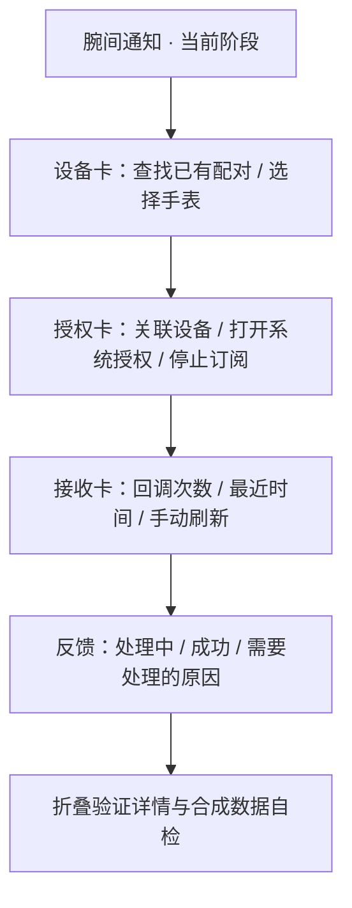

# 页面设计：从诊断原型走向日常使用

暂定产品名「腕间通知」。第一轮已经实现原生 ArkUI 页面，不用 WebView。页面设计与平台验证同时推进，后续沿用相同的信息层级。

## 第一轮首页

首页按人的配置顺序安排：**选择手表 → 允许通知 → 检查接收**。上方摘要说明当前阶段，下方保留一个操作反馈区域。

| 区域 | 已实现行为 | 下一阶段扩展 |
| --- | --- | --- |
| 摘要 | 明确“开发预览”“当前不会在手表显示通知” | 显示手表真实认证/送达状态和最后成功时间 |
| 设备 | 动态列出配对设备、可选择、显示通话连接检查 | 添加协议握手、断连原因和可验证的重连动作 |
| 授权 | 系统原生授权弹窗、授权应用数、明确停止操作 | 应用白名单、敏感通知策略；仍由用户掌握授权 |
| 接收 | 回调与取消条目统计，正文不落盘 | 区分手机接收、等待发送、手表确认，避免一个“已连接”掩盖失败 |
| 反馈 | 所有异步操作期间禁用重复点击；显示错误码与解决方向 | 针对蓝牙关闭、认证失效和电量策略的具体引导 |
| 验证详情 | 默认折叠，只显示元数据；自检明确使用合成数据 | 日常版本转为单独的问题诊断页面 |

不提供虚假的“通知预览”或预填成功计数。第一轮没有真实手表认证状态，因此不展示“手表已连接/通知已送达”的成功标签。

## 视觉规范

| 元素 | 取值与目的 |
| --- | --- |
| 背景 | `#F3F6F8`，白色内容卡，长页面分区清楚 |
| 标题/摘要 | 深蓝 `#142C3F`；摘要用白字，当前阶段一眼可见 |
| 主操作 | 青色 `#087F8C`，同屏最重要按钮明确 |
| 次要文本 | `#5B6F7D`，辅助信息不与主操作争抢注意力 |
| 错误 | 深橙文字与浅橙背景，并附原因；不只依赖颜色 |
| 圆角与间距 | 卡片 24vp，页面侧边 20vp，卡片间 16vp |
| 字号 | 首页标题 30fp，卡片标题 19fp，正文 14fp，说明 12–13fp |
| 操作区 | 主要按钮高 48vp；设备行整行可选，选中有文字勾号 |

手机用户直接看到必要操作；开发版本和平台信息放在“验证详情”。没有账号、云同步或默认通知正文收集。

## 需真机验证的页面状态

1. 未配对、蓝牙授权拒绝、蓝牙关闭、存在多个同名设备、通话连接不可查询。
2. 两种构建模式、通知签名权限不足、尚未用户授权、只授权部分应用、手动停止。
3. 空接收记录、成功接收、后台接收后回到前台、持久化失败与扩展重启。
4. 系统字体放大、长设备名称、手机导航方式和小屏宽度。实际 DevEco Preview/真机截图尚未取得。

本轮先固定浅色主题。深色、读屏焦点、字体最大档和完整屏幕适配在真机反馈后完善，不用示意图代替验收。后续需要的实时状态刷新也将随平台生命周期实测加入；当前按钮明确写作“刷新接收记录”。
